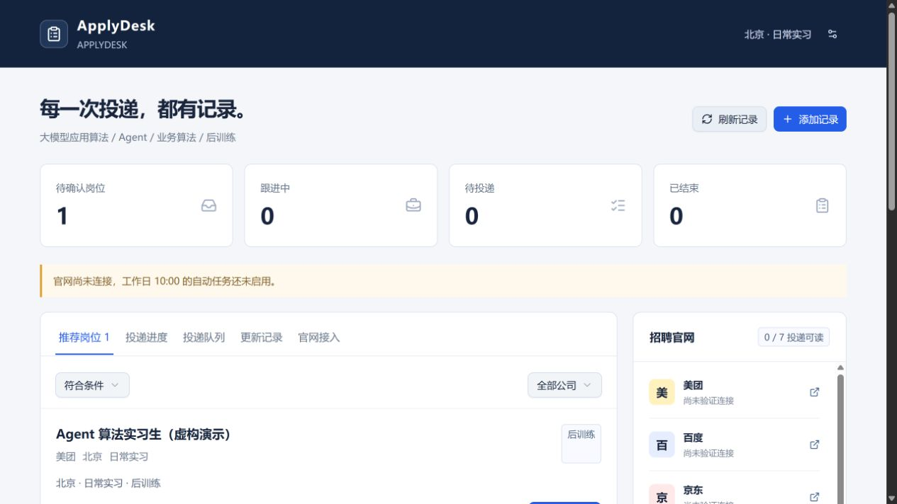

# ApplyDesk

**把实习岗位发现、人工确认、投递进度和飞书记录放进同一个工作台。**

一个从真实求职需求出发、通过人和 AI 协作开发的 **Vibe Coding 项目**。当前版本是本地优先的可运行 MVP：先把已核实的数据和决策留住，再逐步接入自动化。

> 仓库只包含程序、测试和示例配置。没有真实简历、个人投递记录、招聘账号 Cookie、飞书密钥或私人部署地址。



## 能做什么

| 功能 | 当前状态 |
| --- | --- |
| 岗位筛选、详情、人工确认、不考虑、撤回 | 已实现 |
| 已投记录、官网状态原文、变更历史、检查异常 | 已实现 |
| 公司来源状态、岗位检索状态分别展示 | 已实现 |
| SQLite/D1 持久化，重启后保留记录 | 已实现 |
| 飞书专用电子表格创建与同步 | 已实现；使用者需配置自己的应用 |
| 浏览器代理录入官网观察结果 | 提供 HTTP API 和可选 WebMCP 工具 |
| 每天自动抓取招聘网站 | **未实现**；没有内置爬虫或后台巡检进程 |
| 工作日 10:00 调度 | **未启用**；目前仅有目标时间计算与界面 |
| 按方向选择简历、自动填写并提交 | **未实现**；“确认要投”只进入队列 |
| 面向公网的用户认证 | **未实现**；生产构建的业务 API 默认拒绝访问 |

16 个官网定义是来源白名单与导航配置，**不等于 16 个已完成的自动采集适配器**。数据可手动录入，或由你授权的浏览器代理读取页面后写入。页面不可访问、登录失效或数据缺失时，保留异常，不推断成拒绝或零岗位。

## 快速启动

需要 Node.js **22.13+**（推荐 Node 24）。Windows、macOS、Linux 使用相同命令；本地运行不需要 Cloudflare 账号，也不需要模型 API Key。

```bash
npm ci
npm run setup
npm run dev
```

打开 **http://127.0.0.1:5173**。`setup` 按顺序执行本地数据库迁移，可重复运行。它不会初始化远端数据库。

第一次启动没有岗位和投递数据。点击“添加记录”即可使用；`examples/demo-jobs.json` 是明确标注的虚构演示数据，使用配置中的公司名称和无效演示职位路径，不代表该公司真实招聘。可将文件内容作为 JSON 请求体 POST 到本机 `/api/desk`。

本地数据库保存在 `.wrangler/state/`，密钥放在未跟踪的 `.env` 中。删除数据库目录会丢失本机记录；更新程序前请自行备份。

## 日常使用

1. **推荐岗位**：查看来源原文，确认要投或标记不考虑；不明确的岗位进入“待核对”。
2. **投递队列**：保存意愿，尚不执行官网提交。
3. **投递进度**：显示真实投递日期、官网原始状态和最近检查时间。日期只精确到天时不编造时分；日期未注明时保留空值。
4. **官网接入**：分别查看公开职位检索和个人投递记录的状态。
5. **飞书表格**：配置自己的飞书应用后，按按钮创建或同步专用表格。

“刷新记录”刷新数据库中的数据，**不会启动官网抓取**。

## 修改筛选与公司范围

示例配置针对 **北京、日常实习、大模型应用 / Agent / 业务算法 / 后训练**。到岗时间、每周天数和实习时长不参与过滤。

编辑 `lib/domain.mjs`：

- `COMPANIES`：可用于岗位检索的官网白名单。
- `TRACKED_COMPANIES`：个人投递跟踪范围；其余公司只检索岗位。
- `matchJob()`：地点、招聘类型和方向规则。
- `normalizeStage()`：官网原文对应的展示类别。

公司名称、可信域名、共享招聘平台的公司路径必须一并检查。BOSS 直聘不在本示例范围。添加来源应先验证页面可读性，而不是把导航链接当作采集成功。

## 飞书配置（可选）

复制 `.env.example` 为 `.env`，填写自己的应用信息：

```dotenv
FEISHU_APP_ID=
FEISHU_APP_SECRET=
FEISHU_FOLDER_TOKEN=
```

应用需要电子表格创建、读取、编辑权限：`sheets:spreadsheet:create`、`sheets:spreadsheet:read`、`sheets:spreadsheet:write_only`。使用者自行确认授权并发布应用。重启开发服务后再同步。

程序会创建专用表格，并保存返回的表格标识供后续重试复用；不要拿它覆盖已有业务表格。密钥只进入服务端运行环境，不要使用 `VITE_` 前缀，不要把 `.env` 提交到 Git。

## 技术结构

```text
React 看板 / 可选浏览器 WebMCP
              ↓
       本地 HTTP API
              ↓
    校验 → 筛选 → 去重 → 留痕
              ↓
     本地 D1 / SQLite → 飞书 API
```

React + TypeScript + Vinext/Vite + Cloudflare 本地运行时 + Drizzle + D1。浏览器数据不以 localStorage 为业务数据库。

详见 [架构与接口](docs/ARCHITECTURE.md)、[原始需求](docs/PRODUCT.md)、[开发路线](docs/ROADMAP.md)。

## 如何继续 Vibe Coding

把 [AGENTS.md](AGENTS.md)、[产品边界](docs/PRODUCT.md) 和 [开发提示词](docs/PROMPTS.md) 交给你的编码助手。先拿一个可核验的小功能走完“需求 → 实现 → 测试 → 对抗式检查”，再扩展。

不要让 AI 用模拟进度冒充真实连接，或把数据库写入成功描述成官网投递成功。

## 验证

```bash
npm test
npm run typecheck
npm run privacy:check
npm run build
```

启动本地服务后，可用 Python 3.12+ 运行 `python tests/search_smoke.py` 验证 API。测试只访问本机，会生成带随机 `qa-` 标识的数据及 `work/qa-cleanup.sql`；执行 `node scripts/cleanup-test-data.mjs` 清理这些测试数据。

GitHub Actions 执行单元测试、类型检查、导出隐私检查、构建、本地数据库初始化与 API 测试。

## 发布与安全边界

当前版本只面向本机开发，服务绑定回环地址。生产构建默认没有身份提供者，业务 API 拒绝访问；不要直接把开发服务器暴露到公网。公开部署前，需要实现服务器端认证、凭据管理和部署配置，见 [SECURITY.md](SECURITY.md)。

项目使用 MIT 许可证；依赖与组件许可见 [THIRD_PARTY.md](THIRD_PARTY.md)。
