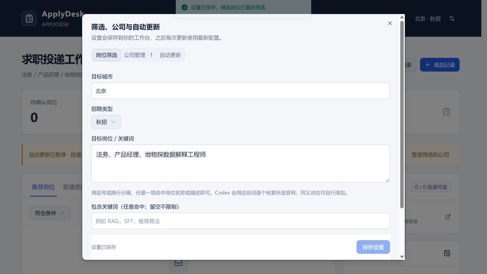

# ApplyDesk

**在 Codex 里说需求，用自己的浏览器检查招聘网站，在本地看板保存岗位和投递进度。**

前提：已安装 Codex 桌面版和浏览器插件。无需模型 API Key、Cloudflare 账号或飞书授权即可开始使用。

## 最快开始

1. 下载 ZIP 并解压，或克隆项目。
2. 在 Codex 中打开这个项目文件夹。
3. 直接说：

> 按 START_HERE.md 帮我启动 ApplyDesk。我想找北京的 Agent 日常实习，先检查美团和字节。我投过美团，帮我跟踪进度。

Codex 会准备环境、启动看板、按你的话保存设置，再用你自己的浏览器检查。必要条件缺失时会简短提问，**不必先填完所有表单**。

Windows 也可以双击 `START.cmd`；macOS / Linux 可运行 `sh START.command`。启动器优先使用现有 Node，也能使用 Codex 自带运行时；缺少 npm 时从官方仓库下载并校验。首次安装需要联网，之后会复用依赖和已有服务。

遇到运行时或权限问题，把错误交给 Codex，并让它继续按 [START_HERE.md](START_HERE.md) 操作。

## 后续直接这样说

- “把这个招聘官网加上，每两周检查一次。”
- “今天只重新查美团，不用等到下周。”
- “我还投过百度，帮我读取进度。”
- “以后只看上海，包含 RAG，排除产品经理。”
- “先暂停自动检查。”
- “每个工作日 10 点检查投递，岗位按公司设置的频率检索。”

完整交互规则见 [对话使用指南](docs/CHAT_GUIDE.md)。网页也提供首次配置、筛选编辑、公司管理，以及可直接粘贴到 Codex 的操作指令。



## 当前可以做什么

| 功能 | 行为 |
| --- | --- |
| 对话式配置 | 指定官网、城市、招聘类型、目标岗位／关键词、关键词；保存到自己的实例 |
| 公司管理 | 预置 16 个招聘入口，也可以新增公司；默认不启用任何公司或个人投递跟踪 |
| 检索与进度 | Codex 使用浏览器读取真实页面，检查结果写入本地数据库 |
| 指定公司重查 | 手动检查可只选一家公司，不受自动暂停和周期限制 |
| 定时更新 | 用户提出要求后，绑定自己的 Codex 定时任务；每家公司可按 7／14 天检索 |
| 记录与决策 | 去重、人工确认、撤回、状态原文、异常与运行日志 |
| 飞书 | 可选，配置自己的应用后创建和同步专用电子表格 |
| 安装与重开 | 自动准备依赖和数据库、识别现有实例、自动避让占用端口 |

新增网址只代表“已配置”，不代表网站已验证可读。登录过期、验证码、访问受限和只读到部分分页会明确记录。缺失字段不会被编造；“确认要投”不会被当成投递成功。

## 使用边界

- 这是 **Codex 协作项目**，没有内置独立的模型服务或无头爬虫。读网站需要 Codex 和已连接的浏览器。
- 自动更新需要电脑开机联网、Codex 运行；每次任务会先确保本地服务启动。不是关机也能运行的云服务。[官方运行条件](https://learn.chatgpt.com/docs/automations)
- 首次授权、登录与验证码由使用者完成。其他人不会继承原作者的账号、任务、飞书凭据、简历或投递记录。
- 投递可选择官网自行操作，或明确指定岗位和简历后交给 Codex 填写提交。网页只交接任务，Codex 链接需发送预填指令；站点登录、验证码、缺失资料和协议确认可能需要本人处理。
- 当前为本机单用户应用；生产构建的业务 API 默认拒绝访问。不要把开发服务直接暴露到公网。
- 支持实习、秋招、春招、社招等类型，岗位名称和关键词不限行业。预置之外的网站可由使用者明确添加；能否读取以实际浏览器结果为准。

## 招聘类型、岗位与浏览器

招聘类型支持日常实习、暑期实习、全部实习、秋招、春招、全部校招、社招和不限类型。不会把一般校招猜成秋招，也不会把全职猜成社招。

“目标岗位／关键词”可以自由填写：法务、产品经理、物探数据解释工程师等。用逗号或换行分隔；任意一个命中职位名称或描述即可，额外的包含／排除词进一步约束。每轮会生成各公司官网的检索清单，由 Codex 使用这些词搜索。

Chrome 和 Edge 都支持，需安装并连接 Codex 插件；在自动更新设置中保存浏览器偏好，也可在对话里指定。

## 简历与投递

已确认要投的岗位有两个入口：**官网自行投递**，或 **交给 Codex 投递**。前者只打开官网，不记作已投；后者选择本机 PDF/DOCX 简历并确认向对应招聘方提交，随后打开 Codex 发送任务指令。也可直接在 Codex 对话中发起。

简历按固定副本和 SHA-256 记录版本；同一岗位防止重复领取。超时、无回执时保留“结果待核实”，不自动重投。只有保存官网成功回执及截图后才更新已投记录。详见 [投递协议](docs/APPLY.md)。本版本通过模拟回执及本地集成测试，未在发布验收中向真实公司提交申请。

## 数据在哪里

业务数据在项目的 `.wrangler/state/`；启动信息、简历副本、投递任务和回执证据在 `.local/`；可选飞书凭据放在未跟踪的 `.env`。升级时保留这三处，先备份，再运行启动器应用迁移。不要通过删除数据库来修复启动失败。

每个解压目录是独立实例。启动器返回实际地址，Codex 会校验实例身份，避免把记录写进其他项目。关闭网页不会删除数据。

## 飞书（可选）

本地看板无需飞书。想同步时复制 `.env.example` 为 `.env`，填写自己的 `FEISHU_APP_ID`、`FEISHU_APP_SECRET`，以及可选 `FEISHU_FOLDER_TOKEN`。应用需要电子表格创建、读取、编辑权限；授权并发布后重启服务。

密钥只用于服务端，不要发到聊天、截图或 GitHub。详见 [自动更新协议](docs/AUTOMATION.md) 和 [安全说明](SECURITY.md)。

## 给开发者

```bash
npm ci
npm run setup
npm run dev
```

日常使用和 Codex 任务使用 `node scripts/start.mjs --json`，不要假设端口固定。没有 WebMCP 时，`scripts/desk.mjs` 提供实例校验后的结构化数据接口；它不能代替浏览器读官网。

```bash
npm test
npm run typecheck
npm run privacy:check
npm run build
```

GitHub CI 包括 Windows / Linux 空目录首次启动与交互数据流程，以及单元、类型、构建和 API 检查。macOS 提供启动脚本，尚未完成真机验收。

- [产品定义](docs/PRODUCT.md)
- [架构与接口](docs/ARCHITECTURE.md)
- [对话操作协议](docs/CHAT_GUIDE.md)
- [自动更新协议](docs/AUTOMATION.md)
- [验证记录](docs/VERIFICATION.md)
- [开发提示词](docs/PROMPTS.md)
- [路线图](docs/ROADMAP.md)

MIT License；依赖许可见 [THIRD_PARTY.md](THIRD_PARTY.md)。
